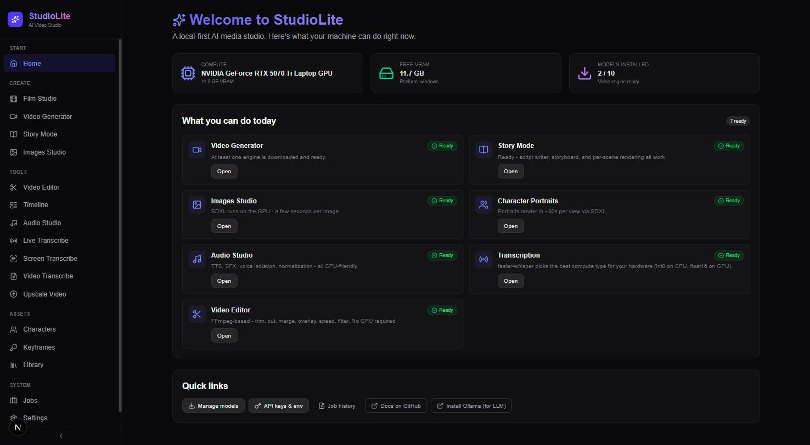
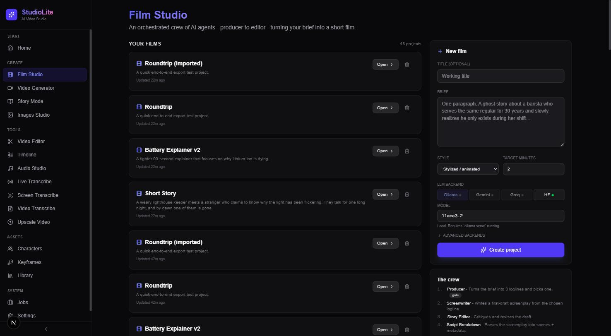
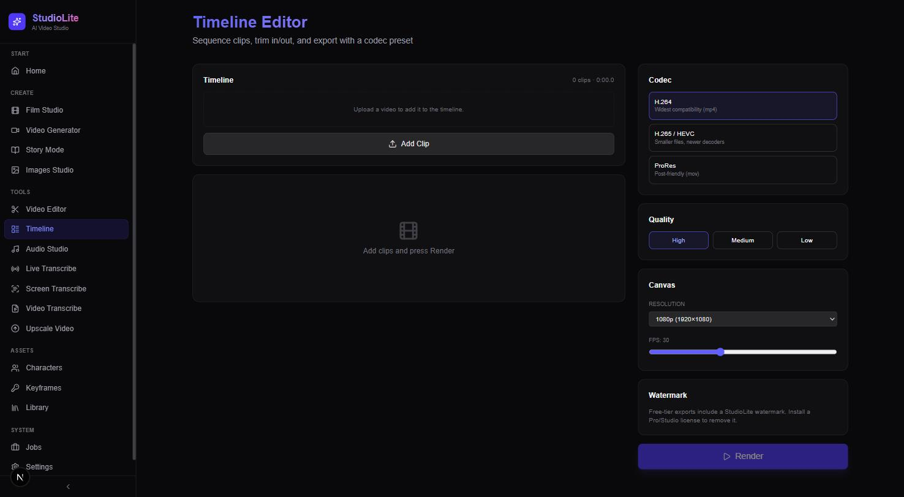
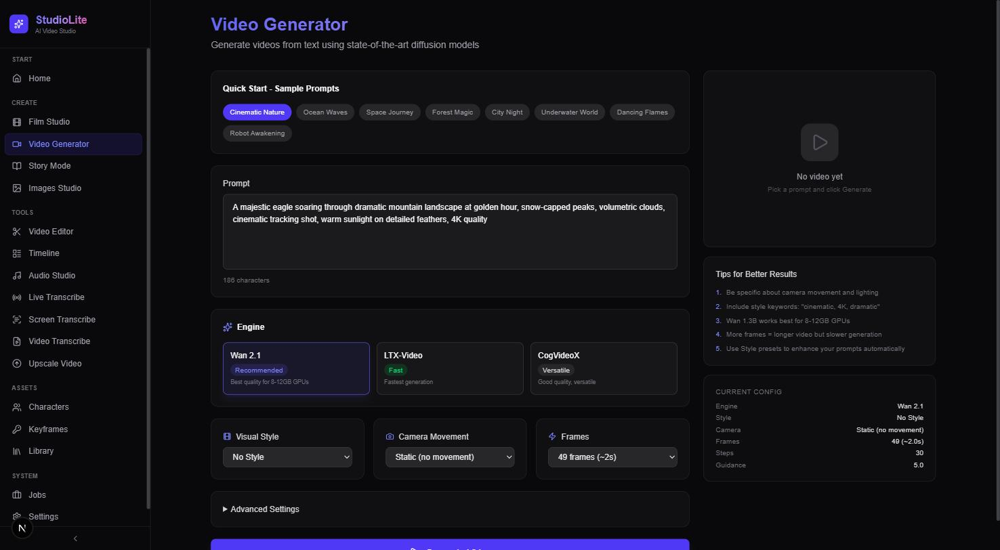
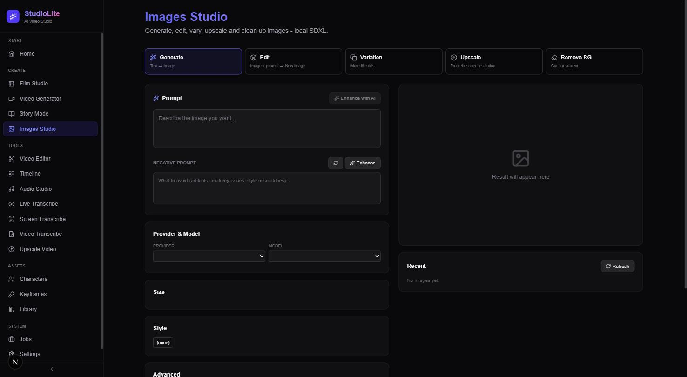
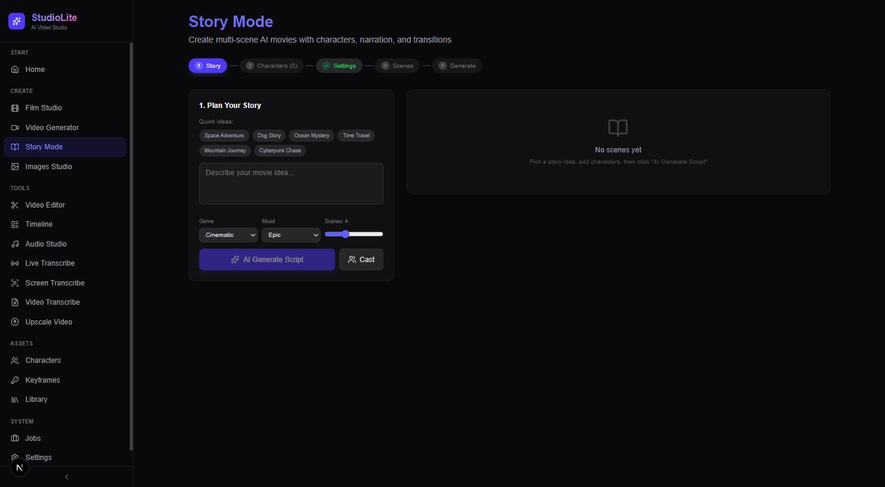
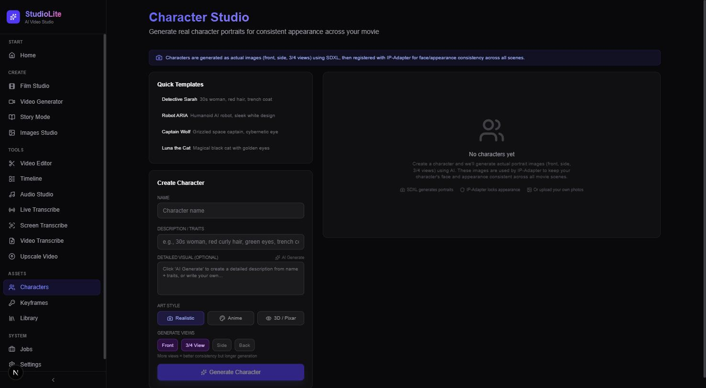
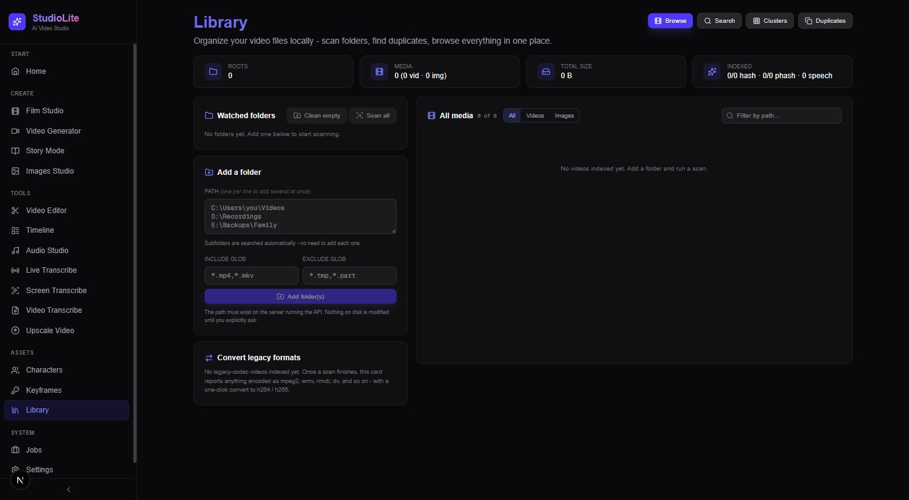
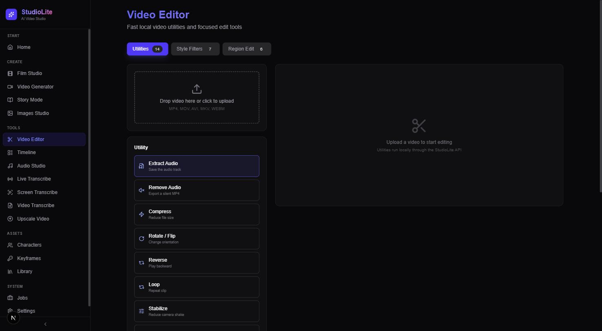
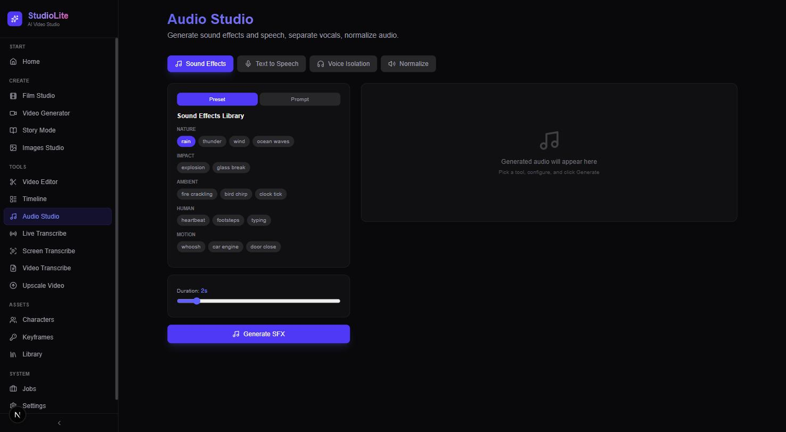

<div align="center">

# StudioLite

**A local-first AI film studio. Type one paragraph, get a finished short.**

[](https://github.com/PawanRamaMali/StudioLite/actions/workflows/ci.yml)
[](LICENSE)
[](https://www.python.org/)
[](https://nextjs.org/)
[](#installation)
[](#pricing-vs-the-alternatives)

**Everything on-device. No cloud accounts. No per-render fees. No data leaves the box.**



</div>

---

## Why StudioLite

You want to make a short film with AI. Today that means signing up for Runway for the motion, ElevenLabs for the voice, Suno for the music, Descript for the edit, and paying a subscription to each while the outputs sit behind a terms-of-service you did not write. Your brief, your characters, your renders, your revisions live on someone else's servers, and every iteration costs credits.

**StudioLite replaces the whole stack with one MIT-licensed app that runs on your own GPU.** One product, one install, one file tree you own. Every model is swappable, every render is free, every file is yours. When the model landscape moves in six months, you swap the weights, you do not resubscribe.

The pipeline is a real crew, not a prompt wrapper: a Producer expands the brief, a Screenwriter drafts, a Cinematographer picks shots, a Shot Generator renders keyframes, Motion animates them, a Voice actor speaks the lines, a Composer scores it, an Editor cuts it. 18 stages, each stage a versioned artifact you can hand-edit and re-run. Or if the whole pipeline is more machinery than you need, use the direct panels for a one-shot render.

---

## What it looks like

### Home dashboard: know what your box can do

The Home panel probes the GPU, counts free VRAM, checks which model weights are on disk, and marks each feature Ready or Missing. No guessing. No "loading" spinner that hides a missing dependency.


### Film Studio: your projects, your pipeline

Every project is a directory on your disk. Every stage is a versioned artifact. Open a film, edit its script, re-run only the stages that changed. Five starter templates so you never open a blank config, and 48 projects in this screenshot because that is what iteration looks like when there is no per-render fee.



### Timeline: an NLE that reads AI clips as first-class citizens

H.264, H.265, ProRes. High, medium, low quality. Multi-clip trim, reorder, watermark toggle. Everything a v1 timeline needs to send a cut to DaVinci for finishing.



### Video Generator: one-shot diffusion, no signup

Wan 2.1 and 2.2, LTX-Video, CogVideoX, HunyuanVideo, AnimateDiff, Stable Video Diffusion. All local, all pluggable. Quick-start prompt chips and per-run configuration on one page, with a live "current config" summary so you know what is actually about to render.



### Images Studio: SDXL family for stills

Text-to-image, edit, variation, upscale, and background removal. All the primitives the pipeline uses, exposed directly so you can iterate on a single frame without spinning up a whole shot.



### Story Mode: multi-scene shorts with narration and score

The middle ground between "one clip" and "full 18-stage pipeline." Pick a genre and mood, pick a cast, click AI Generate Script, review the scene list, render.



### Character Studio: consistency across every shot

SDXL generates real portrait images (front, three-quarter, side, back). IP-Adapter registers them so the same face keeps showing up across scenes. Upload your own reference photos when you want a specific person instead of a generated one.



### Media Library: a local, searchable index of your video life

Point it at folders. It walks them, thumbnails them, perceptual-hashes them, and lets you find duplicates, cluster by content, search by meaning (CLIP embeddings) or by transcript (FTS5 full-text). Batch-convert legacy codecs (mpeg2, wmv, rmvb, dv) to H.264 in one click.



### Video Editor: fourteen focused utilities

Trim, merge, compress, rotate, stabilize, color-correct, region-effect, picture-in-picture, background music mix, speed, reverse, loop, GIF, thumbnail. Every operation runs as a background job with progress polling, so you can queue five things and walk away.



### Audio Studio: SFX, TTS, voice isolation, normalization

Sound effects library with categories (nature, impact, ambient, human, motion) plus a prompt mode. Text-to-speech through Piper, KittenTTS, XTTS-v2, IndexTTS-2. Voice isolation and loudness normalization on the same page.



---

## How StudioLite beats the alternatives

The bet: **one open-source, local, pipeline-native product beats a stack of subscriptions for anyone who wants to iterate.** Here is where that bet holds and where it does not.

### vs the cloud AI-video services (Runway, Pika, Luma, Sora)

| | StudioLite | RunwayML | Pika | Luma | Sora |
|---|:---:|:---:|:---:|:---:|:---:|
| Per-render cost | **$0** | ~$0.05 / second | Credit tiers | Credit tiers | Credit tiers |
| Multi-scene film from a brief | **✔ 18-stage pipeline** | ✗ | ✗ | ✗ | ✗ |
| Runs offline | **✔** | ✗ | ✗ | ✗ | ✗ |
| Own the outputs | **✔ on your disk** | ToS-bound | ToS-bound | ToS-bound | ToS-bound |
| Open source | **✔ MIT** | ✗ | ✗ | ✗ | ✗ |
| Model swap | **✔ every stage** | ✗ | ✗ | ✗ | ✗ |
| Batch export | **✔** | Limited | Limited | Limited | Limited |
| Single-shot motion fidelity | Backend-dependent | Strong | Strong | Strong | **State of the art** |
| Hardware needed | 12-24 GB VRAM | None | None | None | None |

**Where StudioLite wins:** the workflow. Runway and Pika are excellent at generating one shot. They are not built to turn "a ghost story about a barista" into a fifteen-shot film with named characters, a written screenplay, per-scene shot lists, voice, music, and a cut. StudioLite is.

**Where it trails:** raw single-shot fidelity. Sora is state of the art. Runway Gen-4 is a generation ahead of what Wan 2.2 and LTX produce locally. If the goal is one hero shot for a commercial, use them. If the goal is a self-contained short film you own end-to-end, use StudioLite.

### vs the commercial NLEs (Premiere, DaVinci Resolve, Final Cut)

| | StudioLite | Premiere Pro | DaVinci Resolve | Final Cut Pro |
|---|:---:|:---:|:---:|:---:|
| Cost | **Free (MIT)** | ~$23 / month | Free / $295 Studio | $300 one-time |
| Codec presets (H.264 / H.265 / ProRes) | **✔** | ✔ | ✔ | ✔ |
| AI-generated shots as source clips | **✔ native pipeline** | Plugin-required | Plugin-required | Plugin-required |
| Batch render | **✔** | ✔ | ✔ | ✔ |
| Platforms | **Win + Linux + Mac** | Win + Mac | Win + Mac + Linux | Mac only |
| Open source | **✔** | ✗ | ✗ | ✗ |
| Multi-track audio | Not yet | ✔ | ✔ | ✔ |
| Color grading | Basic utility | Lumetri | **Industry standard** | ✔ |
| Motion graphics | ✗ | After Effects | Fusion | Motion |

**Where StudioLite wins:** the on-ramp. Every clip you generate is already in the timeline library. No round-tripping through Premiere plugins to talk to Runway, no exporting from Pika to import into DaVinci. It is one app.

**Where it trails:** finishing. StudioLite ships a v1 timeline on purpose. If you need color grading, multi-track mixing, or motion graphics, run DaVinci Resolve on the exported cut. StudioLite is the "shots-through-rough-cut" stage.

### vs the point AI tools (Descript, HeyGen, ElevenLabs, Suno)

| | StudioLite | Descript | HeyGen | ElevenLabs | Suno |
|---|:---:|:---:|:---:|:---:|:---:|
| Monthly floor | **$0** | $12-24 | $24-89 | $5-330 | $8-24 |
| Voice cloning | **✔ local** | Cloud | Cloud | Cloud | ✗ |
| Music generation | **✔ local** | Stock only | Stock only | ✗ | Cloud |
| Transcription (WhisperX) | **✔ local** | Cloud | ✗ | Cloud | ✗ |
| Runs offline | **✔** | ✗ | ✗ | ✗ | ✗ |
| One product, all of it | **✔** | Partial | Partial | Voice only | Music only |
| Own the outputs | **✔** | Limited | ToS-bound | Limited | ToS-bound |

**Where StudioLite wins:** stitching. Four subscriptions become one install. And when ElevenLabs releases a better model, you swap the backend in a config file, not by canceling and re-signing.

**Where it trails:** the raw category leaders. ElevenLabs voices sound better than IndexTTS-2 today. Suno melodies out-catch MusicGen. The gap is closing quickly (IndexTTS-2 is very good) but it is real.

---

### Pricing vs the alternatives

For one filmmaker doing one 60-second short a month, comparable stacks look like this:

| Stack | Monthly | Own outputs | Runs offline |
|---|---:|:---:|:---:|
| **StudioLite** | **$0** | **Yes** | **Yes** |
| Runway Standard + ElevenLabs Starter + Suno Pro | ~$32 | Partial | No |
| Runway Pro + ElevenLabs Creator + Suno Pro + Descript Creator | ~$78 | Partial | No |
| Runway Unlimited + ElevenLabs Pro + Suno Premier + Descript Pro | ~$170 | Partial | No |

At heavier iteration (five shorts a month), the credit-based services outrun their tier limits and jump to the next plan. StudioLite stays $0. Only your electricity bill scales.

---

## Features at a glance

**Pipeline (18 stages, versioned artifacts, resumable):**
Producer, Beats, Outline, Cast, Screenwriter, Cinematographer, Shot Breakdown, Character Portraits, Shot Generator, Motion Shots, Continuity, Voice Actor, Composer, SFX, Editor, Mixer, Upscale, Delivery.

**Model backends (all local, all swappable):**
- **LLM:** Ollama, Gemini, Groq, Hugging Face
- **Stills:** SDXL Turbo, SDXL Base, Z-Image Turbo, FLUX Schnell
- **Motion:** Wan 2.1 / 2.2, HunyuanVideo, LTX-Video, AnimateDiff, SVD I2V, Ken Burns fallback
- **Voice:** Piper, KittenTTS, XTTS-v2, IndexTTS-2, Qwen3-TTS, Chatterbox
- **Music:** MusicGen, ACE-Step
- **Upscale:** Real-ESRGAN 2x / 4x

**Direct tools:**
Timeline editor, Video Generator, Story Mode, Images Studio, Character Studio, Video Editor (14 utilities), Audio Studio, Live/Screen/Video Transcribe, Upscale.

**Infrastructure:**
- Every background task is a job. Cancel, retry, or resume across process restarts (SQLite-persisted).
- Every project is a portable directory. Export to `.studioproj`, import on another machine.
- One-click delivery zip: final cut, CREDITS.md, manifest, ready to hand off.
- Offline Ed25519 licensing with tier and feature gating. Nothing calls home.
- Opt-in local telemetry with a redacted diagnostic bundle you export by hand.
- Source-based Windows installer with optional Authenticode signing and a release manifest.

---

## Architecture

```
                                 ┌──────────────┐
                                 │   Next.js    │  :3000
                                 │  (React UI)  │
                                 └──────┬───────┘
                                        │ REST + WebSocket
                                 ┌──────▼───────┐
                                 │   FastAPI    │  :8000
                                 │ api_server.py│
                                 └──────┬───────┘
             ┌──────────────┬──────────┼──────────────┬─────────────────┐
             │              │          │              │                 │
      ┌──────▼─────┐ ┌──────▼─────┐ ┌──▼──────────┐ ┌─▼─────────┐ ┌────▼──────┐
      │ filmmaker  │ │  library   │ │ api/routers │ │  models   │ │  jobs +   │
      │ (pipeline) │ │ (media db) │ │ (extracted) │ │ (SDXL /   │ │  license  │
      │  18 stages │ │ FTS5 + CLIP│ │             │ │ Wan / TTS)│ │  SQLite   │
      └────────────┘ └────────────┘ └─────────────┘ └───────────┘ └───────────┘
```

Runtime output lives under `.mp/` (git-ignored). Every long-running task is a job, every job reports progress, is cancellable, is retryable, and survives a process restart.

---

## Installation

### Prerequisites

- Python 3.11
- Node.js 22
- FFmpeg on PATH
- For the GPU-heavy features, an NVIDIA GPU with 12 GB or more of VRAM

**Ubuntu:**

```bash
sudo apt update
sudo apt install -y ffmpeg imagemagick python3-venv python3-dev build-essential
```

**Windows:**

```powershell
winget install Gyan.FFmpeg
winget install ImageMagick.ImageMagick
```

**macOS:**

```bash
brew install ffmpeg imagemagick
```

### Set up the app

```bash
git clone https://github.com/PawanRamaMali/StudioLite.git
cd StudioLite

python -m venv venv
# Windows: .\venv\Scripts\activate
source venv/bin/activate

# Pick one based on hardware:
pip install -r requirements-cuda.txt   # NVIDIA GPU
# or
pip install -r requirements-cpu.txt    # CPU-only

pip install -r requirements.txt

# Front-end
cd web && npm install && npm run build && cd ..
```

### Docker

```bash
docker compose --profile cuda up   # NVIDIA
docker compose --profile cpu  up   # CPU-only
```

Both profiles publish `:3000` (Next.js) and `:8000` (FastAPI). Model weights persist under bind-mounted `.models/` and `.mp/` volumes.

---

## Usage

Start everything with the one-click launcher:

```bash
# Linux / macOS
./launch.sh
# Windows
.\launch.ps1        # or double-click launch.bat
```

The launcher boots FastAPI on `:8000` and Next.js on `:3000`, waits for both to be reachable, and opens the browser. Ctrl+C cleanly stops both.

Manual start:

```bash
python api_server.py                           # backend on :8000
cd web && npm run dev                          # frontend on :3000
```

### Your first film

1. Open the **Film Studio** panel.
2. Pick a template. "Short Story" is a good first pick.
3. Edit the sample brief, or replace it with your own paragraph.
4. Click **Create**.
5. Click **Run**. Watch the pipeline advance stage-by-stage in the event stream.
6. Edit any stage's artifact between runs. Downstream stages automatically mark themselves stale, so a re-run only touches the affected shots.
7. When it finishes, click **Package** to get a delivery zip.

---

## Configuration

Copy `config.example.json` to `config.json` (git-ignored) and edit.

| Variable | Purpose |
|---|---|
| `HF_TOKEN` | Hugging Face token for gated models |
| `HF_HOME` | Custom cache dir for HF weights |
| `NEXT_PUBLIC_API_URL` | Backend URL used by the Next.js UI |
| `CUDA_VISIBLE_DEVICES` | Which GPU(s) to expose |
| `PYTORCH_CUDA_ALLOC_CONF` | Memory allocator tuning |
| `STUDIOLITE_AUTH` | `on` or `off` for API bearer auth |
| `STUDIOLITE_LICENSE_FILE` | Custom path for the offline license |
| `GEMINI_API_KEY`, `GROQ_API_KEY` | Cloud LLM backends (optional) |

Every managed variable is editable from the Settings panel too.

---

## Windows setup package

`packaging/windows/build.py` builds a source-based IExpress installer:

```powershell
python packaging/windows/build.py
```

Outputs land under `dist/`: `StudioLite-Setup.exe`, a fallback zip, SHA-256 checksums, and `release-manifest.json` describing the build.

**Signing is opt-in.** Set `STUDIOLITE_SIGN_THUMBPRINT` (SHA-1 of the code-signing cert in your user store), optionally `STUDIOLITE_SIGN_TSA` (defaults to DigiCert), and optionally `STUDIOLITE_SIGNTOOL` (full path). If any of those are missing, the build finishes unsigned and records the reason in the manifest. See `packaging/windows/README.md` for the full release procedure.

---

## Licensing model

The **code** is MIT. The **product** ships a two-tier entitlement layer for feature gating:

| Tier | What you get | Watermark on export |
|---|---|:---:|
| Free | Full pipeline, all editors, all tools | ✔ |
| Pro / Studio | Same, plus watermark removal | ✗ |

Licenses are Ed25519-signed JSON payloads carrying tier, features, optional device fingerprint, expiry, and grace-days. Verification is offline. Nothing calls home.

For your own installs, the free tier is unlimited. For third-party distribution (packaging StudioLite as part of a product), the licensing scaffold gives you a clean way to gate features.

---

## Contributing

- Open an issue for anything that surprised you, especially wrong outputs.
- PRs welcome. Keep changes focused. New features should ship with tests under `tests/`.
- The test suite is 162 tests and CI is green on both Ubuntu and Windows. Please keep both true.

## License

MIT for the source. See `LICENSE`.

Third-party dependencies, bundled fonts, and model weights each carry their own licenses. See `THIRD_PARTY_NOTICES.md` for the full list. Note that some model weights (Stable Diffusion XL, HunyuanVideo, LTX-Video, CogVideoX 5B) have restrictions on commercial use that supersede StudioLite's MIT grant.
